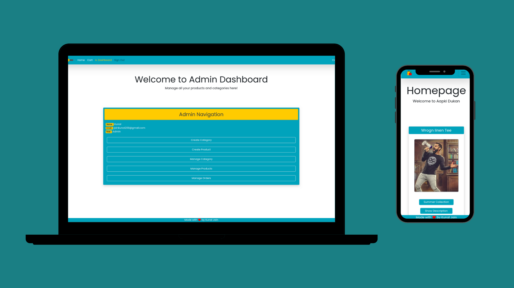

# Apni Dukan

   

# Project Description

The project aims to provide E-Commerce solution to local shopkeeprs. It has features to create, update, and delete products and categories. It also has feature for admin to manage users and orders. The application also has Razorpay payment gateway integration in demo mode.
The application also has Dark Mode :relieved:

# Features Implemented

## 1. Frontend

1. Home page for users to see all products.
2. Carts page to view and manage products added to the cart and to process payment.
3. Login - SignUp pages for auth.
4. Admin pages:
   - Admin Dashboard page
   - Create product page
   - Create categories page
   - Manage products page
   - Manage categories page
   - Update products page
   - Update categories page
5. Contact us page for getting in touch with the developer.

## 1. Backend

1. Auth Routes:
   - SignUp
   - Login
   - Authorization (JWT Verification)
2. User Routes:
   - Get user details
   - Update user
   - Get all orders
3. Admin Routes:
   - Products Specific:
     - Get a specific product
     - Get all products
     - Get all products of a specific category
     - Get photo of a specific product
     - Create Product
     - Update Product
     - Delete Product
   - Categories Specific:
     - Get a specific category
     - Get all categories
     - Create Category
     - Update Category
     - Delete Category
   - Order Specific:
     - Get a specific order detail
     - Get all orders
     - Create Order
     - Get order status
     - Update order status
4. Payment Routes

 

# Features to Implement

## 1. Frontend

1. User:
   - Profile page
   - Add and update profile image page
   - View orders page
2. Admin:
   - Mange orders page
   - Manage users page

More features to be listed in future.

## 1. Backend

1. Add upload, edit and remove profile picture functionality.

More features to be listed in future.

# Technologies and Packages Used

## 1. Frontend

1. React
2. React-router
3. Bootstrap

## 2. Backend

1. Node
2. Express
3. MongoDB
4. Mongoose
5. Razorpay
6. JWT
7. Bcryptjs

# Local Setup

Clone the frontend and backend repositories, cd into them individually, and then follow the below mentioned steps for setting up backend and frontend seprately.

## 1. Frontend

1. Fork the repository.
2. Clone the repository (`git clone URL`).
3. Open the folder in which you cloned the repository.
4. Run `npm install`.
5. Create a .env file same as the given env file (.example.env).
6. Setup your backend using the below mentioned steps. Now you can either deploy your backend separately and use the hosted link or run localy and use that respective link.
7. If you want to use Razorpay payments gateway as well generate your REACT_APP_KEY_ID using [this link](https://razorpay.com/docs/payment-gateway/dashboard-guide/settings/api-keys/) and then substitute it in the .env file.
8. After you successfully add the backend url to your .env file you can run `npm start` and start working localy.

## 2. Backend

1. Fork the repository.
2. Clone the repository (`git clone URL`).
3. Open the folder in which you cloned the repository.
4. Run `npm install`.
5. Create a .env file same as the given env file (.example.env).
6. Create a local MongoDB database using mongo shell or you can use hosted MongoDB database as well using MongoDB Atlas. Once any one of them is setup you can substitute their URI in the .env file.
7. Add a secret value to .env file.
8. If you want to use Razorpay payments gateway as well generate your KEY_ID and KEY_SECRET using [this link](https://razorpay.com/docs/payment-gateway/dashboard-guide/settings/api-keys/) and then substitute it in the .env file.
9. Now you can run `npm start` and start working localy.

### Note:

Run `npm start` in the Backend repo first and then in Frontend .

### Code of Conduct

[Read here](https://github.com/kunaljain0212/Apni-Dukan-Frontend/blob/master/CODE_OF_CONDUCT.md)

### Contribution Guidelines

[Read here](https://github.com/kunaljain0212/Apni-Dukan-Frontend/blob/master/CONTRIBUTION.md)

### License

[Read here](https://github.com/kunaljain0212/Apni-Dukan-Frontend/blob/master/LICENSE)

